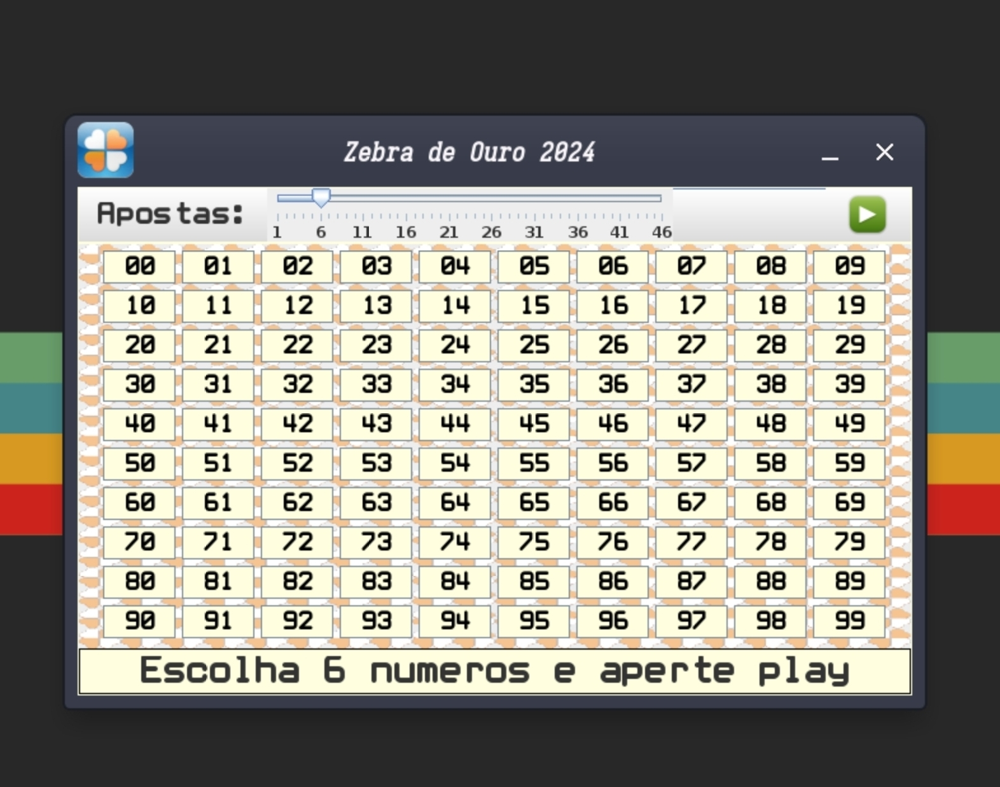
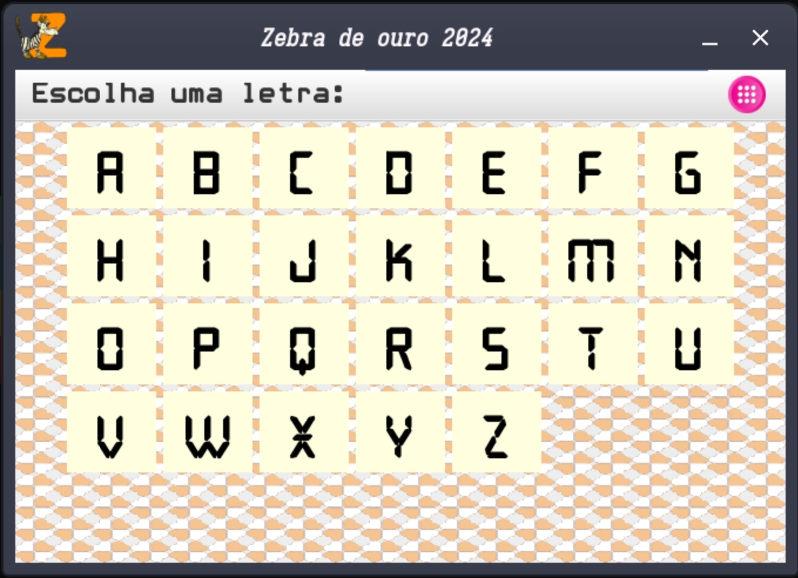
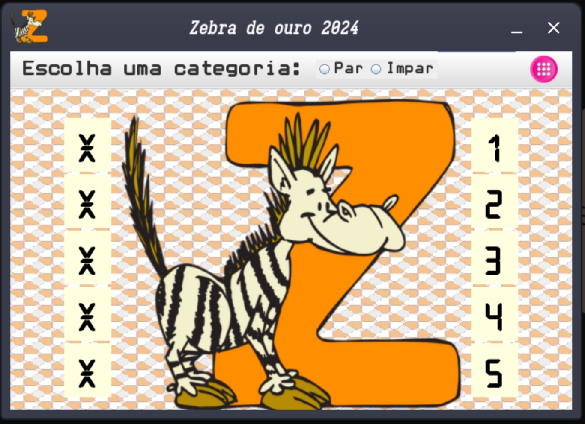
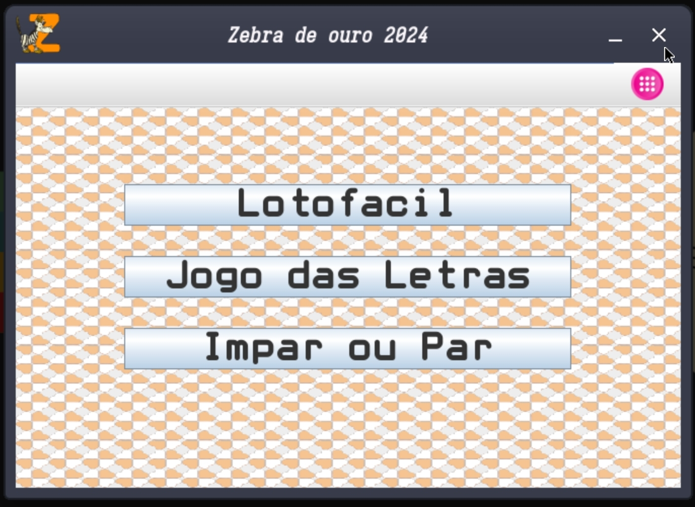
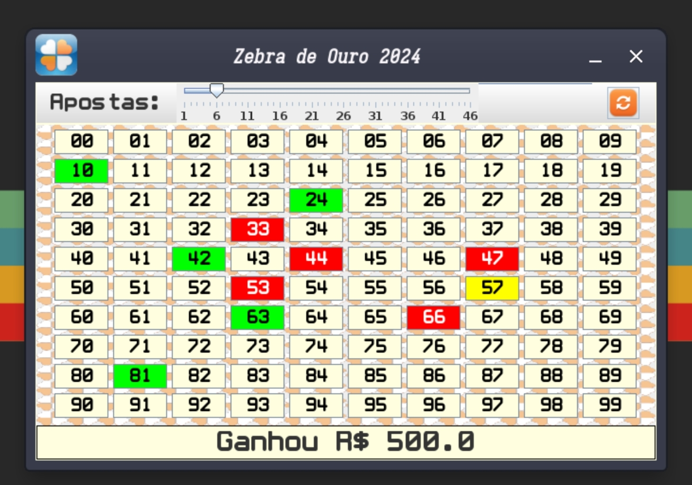

# Loto Fácil



## Proposta

LotoFacil é um programa que simula um sorteio de loteria
você pode escolher quantos números quiser e testar sua sorte.

## Minigames
LotoFacil possui mais dois Minigames
### Letra da Sorte:



### Par ou Impar:



### Todos esses games podem ser acessados na janela de menu:



## Instalação

### Observação 
Este programa foi escrito para ser usado em um ambiente linux, no entanto seu código fonte
se encontra na pasta *src* para outros formatos de compilação.


### Instalação Linux

Ao adentrar a pasta do projeto dígite:

``` bash
    # 1° passo:
    make
    # 2° passo:
    make run
    # Caso queira gerar um arquivo .jar:
    make jar
```

## Como jogar no Zebra de ouro:
Após instalar o programa e selecionar uma modalidade siga as recomendações do game
escolhido. 

### Ex (LotoFacil):
Escolha alguns números e aperte play:



#### caso queira alterar uma casa selecionada é so clicar nela novamente.

## Caso deseje alterar o números de casas selecionadas, altere o slider:


